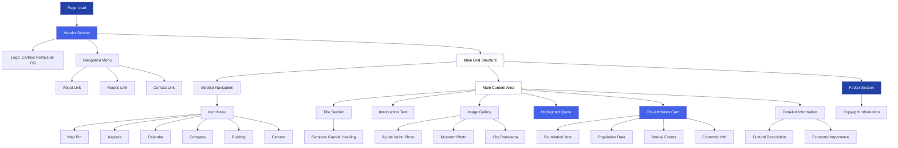

# PostaisCG

A responsive web page showcasing the iconic landmarks and cultural heritage of Campina Grande, Paraiba, Brazil. This project demonstrates CSS Grid layout techniques to create a magazine-style design that adapts seamlessly across different screen sizes.

## Description

PostaisCG (Postcards of Campina Grande) is a single-page web application that presents one of the most beloved landmarks of Campina Grande - the Açude Velho (Old Dam). The page serves as a digital postcard, highlighting the city's rich cultural heritage, its famous São João festival, and its role as a technological and university hub in Northeast Brazil.

The project features a sophisticated grid-based layout that organizes content in a visually appealing magazine format, with strategic image placement, highlighted quotes, and detailed information about the city's characteristics and importance.

## Features

- **Responsive Grid Layout**: Advanced CSS Grid implementation for flexible content organization
- **Magazine-Style Design**: Professional layout with multi-column content distribution
- **Navigation System**: Header navigation with quick links and sidebar icon navigation
- **Image Gallery**: Strategic placement of landmark photographs
- **Highlighted Content**: Featured quotes and attribute cards with gradient backgrounds
- **Mobile Optimization**: Fully responsive design that adapts to mobile, tablet, and desktop screens
- **Smooth Transitions**: Hover effects and animations for enhanced user experience

## Technologies Used

- **HTML5**: Semantic markup structure
- **CSS3**: Advanced styling with Grid and Flexbox
- **CSS Grid**: Primary layout system for complex content arrangement
- **Flexbox**: Secondary layout for navigation and smaller components
- **Google Fonts**: Vollkorn typography for elegant readability
- **Responsive Design**: Media queries for multi-device support

## Main Application Flow

## Responsive Breakpoints

The project uses CSS Grid with media queries to ensure optimal viewing across devices:

- **Desktop** (>1200px): Full grid layout with sidebar and two-column content
- **Tablet** (760px - 1200px): Adjusted grid maintaining sidebar with content flow
- **Mobile** (<760px): Single column layout with horizontal scrolling sidebar

## CSS Grid Implementation

The project showcases advanced CSS Grid techniques:

- **Grid Template Areas**: Named grid areas for semantic layout structure
- **Grid Column Spanning**: `grid-column: 1 / -1` for full-width elements
- **Grid Row Spanning**: `grid-row: span 2` for image positioning
- **Responsive Grid**: Dynamic column adjustment based on viewport
- **Nested Grids**: Grid within grid for complex content arrangement

## Applied Concepts

- **CSS Grid Layout**: Primary layout system with template areas
- **Flexbox**: Navigation menus and flexible components
- **Responsive Design**: Mobile-first approach with media queries
- **Typography**: Custom font loading and text styling
- **Box Shadow**: Depth and elevation effects
- **Linear Gradients**: Background styling for cards and sections
- **CSS Transitions**: Smooth hover effects
- **CSS Animations**: Keyframe animations for visual feedback

## Content Highlights

The page features information about:

- **Açude Velho**: The main landmark and gathering place
- **Museum of Pandeiros**: Architectural tribute to regional music
- **City Statistics**: Foundation, population, and economic data
- **Cultural Events**: São João festival and artisan exhibitions
- **Economic Role**: Technology hub and university center

## Author

**Luiz Augusto Oliveira**